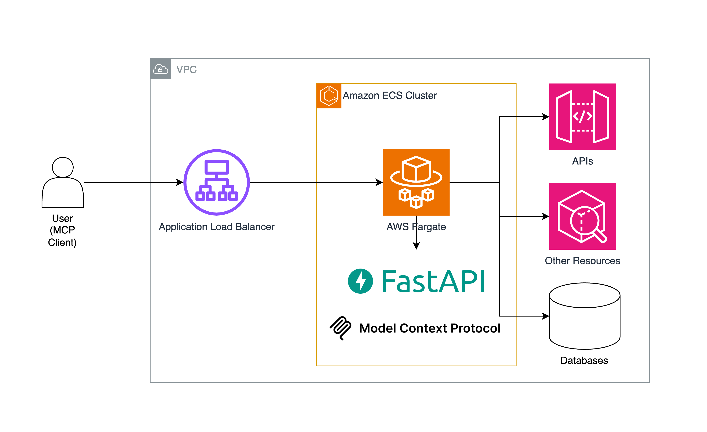

# Deploy MCP Servers on AWS using AWS Fargate

1. Make sure you have AWS CDK installed `npm install -g aws-cdk@latest`
2. `cdk deploy`
3. Create your MCP Client using HTTP as transport layer
4. Ping the server
